```mermaid
flowchart TD
	A([BAŞLA]) --> B["İşlem"] --> C{Koşul?}
	C -- Evet --> D["Alt işlem"] --> C
	C -- Hayır --> X([BİTİR])
```

# Mermaid Diyagram Kullanım Rehberi

Bu rehber; projedeki tüm algoritma diyagramlarının (akış, karar, döngü) VS Code ve GitHub Markdown içinde doğal olarak render edilen **Mermaid** sözdizimi ile tutarlı biçimde yazılması için standartları tanımlar. Tüm önceki harici çizim aracı yaklaşımları (ör. Draw.io) tamamen kaldırılmıştır; depo içinde artık hiçbir `.drawio` kaynağı tutulmamalıdır.

---
## 1. Amaç
- ✅ Tek tip görünüm ve öğrenme deneyimi
- ✅ Kolay bakım ve genişletilebilirlik
- ✅ Çevrimdışı / kurumsal ağ senaryolarında erişilebilirlik
- ✅ Otomatik referans ve link düzeni

---
## 2. Diyagram Kaynağı ve Konumlandırma
Artık ayrı dosya gerekmez. Diyagramlar ilgili haftanın `ders_icerik.md` dosyasına gömülü Mermaid kod blokları şeklinde yazılır.

İstisna (opsiyonel): Çok büyük diyagramlar alt bölümlere ayrılacaksa aynı dosya içinde başlıklarla ayrılmalıdır; ek dosya oluşturmayın.

---
## 3. Mermaid Diyagram Tasarım Standartları

> Uyum Notu (2025-10-01): Depodaki tüm diyagramlar GitHub'ın şu an desteklediği klasik Mermaid düğüm sözdizimini kullanacak şekilde (örn. `A([BAŞLA])`, `B[/Girdi/]`, `C{Koşul?}`) güncellendi. Daha önce kısa süreliğine kullanılan `node@{ shape: ..., label: "..." }` biçimi GitHub Markdown önizleyicisinde parse hatasına yol açtığı için kaldırıldı.

### 3.0 Şekil (Shape) Eşleme Tablosu
Kullanıcı tarafından tanımlanan pedagojik şekil standardı klasik sözdizime şu şekilde yansıtılır:

| Anlam | Modern (kullanılmıyor) | Klasik Mermaid Karşılığı | Örnek |
|-------|------------------------|--------------------------|-------|
| Başla / Bitir (terminal) | `shape: stadium` | `([BAŞLA])` | `A([BAŞLA])` |
| İşlem / Atama | `shape: rect` | `[işlem]` | `P[sonuç ← a+b]` |
| Giriş (Input) | `shape: lean-r` | `[/girdi al/]` | `IN[/Sayı al/]` |
| Çıkış (Output / Yazdır) | `shape: doc` | `node@{ shape: doc, label: "..." }` | `OUT@{ shape: doc, label: "Toplam" }` |
| Karar (if) | `shape: diamond` | `{koşul?}` | `D{sayı % 2 == 0?}` |
| Döngü koşulu | `shape: hex` | `{koşul?}` + gerekirse açıklayıcı etiket | `L{i <= n?}` |
| Döngü etiket düğümü (opsiyonel) | (ayrı shape) | `((DÖNGÜ))` | `LOOP((DÖNGÜ))` |

Notlar:
1. **Çıkış düğümleri için `@{ shape: doc }` kullanımı:** GitHub'ın güncel Mermaid renderer'ı bu modern attribute syntax'i destekliyorsa diyagramlarda kullanılır. Parse hatası alırsanız klasik `[Çıktı]` formatına geri dönebilirsiniz.
2. Döngü koşulları için ayrı bir altıgen shape klasik sözdizimde bulunmadığından karar bloğu `{ ... }` ile temsil edilir; gerekirse metin "(döngü)" şeklinde genişletilebilir.
3. GitHub ileride modern attribute sözdizimini desteklerse bu bölüm güncellenip dönüşüm yeniden değerlendirilebilir.

**Doc Shape Fallback:** Eğer `@{ shape: doc, label: "..." }` GitHub'da parse hatası verirse, çıkış düğümlerini şu alternatiflerle değiştirin:
- `[\\Sonuç\\]` (ters eğik çizgi vurgusu)
- `[📄 Sonuç]` (emoji ile görsel ayrım)
- `[Sonuç]` (düz klasik format)


### 3.1 Genel Sözdizimi
Temel akış diyagramı şablonu:
````

````

### 3.2 Düğüm Tipleri
| Amaç | Biçim | Örnek |
|------|------|-------|
| Başlangıç / Bitiş | `( )` yuvarlatılmış köşeli: `[BAŞLA]` | `A([BAŞLA])` |
| İşlem | Köşeli parantez | `B["sayı al"]` |
| Karar | Süslü parantez | `C{n > 0?}` |
| Alt süreç / Döngü etiketi | Çift parantez | `L((DÖNGÜ))` |
| Veri / I/O (opsiyonel) | Köşeli + fiil | `IN["Veri al"]` |

Renk özelleştirmesi şimdilik yapılmıyor (düz okuyabilirlik). İleride global tema eklenebilir.

### 3.3 Biçim Kuralları
- Düğüm kimlikleri kısa ve anlamlı olmalı: `A, B, C` veya `IN, PROC, DEC` gibi.
- Etiketlerde Türkçe karakter kullanılabilir.
- Karar düğümlerinde çıkışlar `-- Evet -->`, `-- Hayır -->` veya bağlama göre `-- Doğru --> / -- Yanlış -->` şeklinde yazılır.
- Döngü gösterimi: Karar düğümüne geri dönen ok veya `L((DÖNGÜ))` gibi görsel işaret.

### 3.4 Kod Blok Stil Tutarlılığı
- Her diyagram ayrı bir ` ```mermaid ` kod bloğunda.
- Akış yönü varsayılan: `flowchart TD` (Top-Down). Yatay istenirse `LR` açıkça belirtilir.
- Diyagram hemen üstünde açıklayıcı başlık (`**Mermaid Akış Diyagramı:**`).

---
## 4. Gömme (Embed) Standartları
Ekstra iframe, resim veya dış servis kullanılmaz. Sadece Markdown içi Mermaid blokları.

Yanına açıklama gerekiyorsa diyagram üstü veya altı normal metin kullanın; `<details>` yalnızca çok uzun varyantları saklamak için.

---
## 5. Çevrimdışı / Engelli Render Durumu
GitHub veya VS Code bazı ortamlarda Mermaid'i kapatırsa kod blokları düz metin olarak görünür. Bu durumda:
1. Kod bloğunu kopyalayın.
2. https://mermaid.live sitesine gidin.
3. Editör alanına yapıştırıp diyagramı görüntüleyin.

---
## 6. Versiyonlama
Mantıksal değişikliklerde altına kısa not ekleyin:
```
> Not (2025-10-01): Döngü koşulu i < 10'dan i <= 10'a güncellendi.
```

---
## 7. Sorun Giderme
| Sorun | Neden | Çözüm |
|-------|-------|-------|
| Diyagram render olmuyor | Mermaid destek kapalı | VS Code Settings: Markdown > Preview: mermaid etkinleştir / veya mermaid.live kullan |
| Çok karışık görünüm | Aşırı düğüm | Diyagramı 2 küçük diyagrama böl |
| Döngü okunmuyor | Geri ok karmaşık | Döngü etiket düğümü (L((DÖNGÜ))) ekle |
| Karar dalları belirsiz | Etiket yok | `-- Evet -->` / `-- Hayır -->` ekle |
| Parse error 'got end' | `end` node id'si ayraç/parsing ile çakışıyor | Node kimliğini `endNode` / `finish` yapın |

---
## 8. Yeni Diyagram Eklerken Kontrol Listesi
- [ ] ` ```mermaid ` bloğu doğru açılıp kapandı mı?
- [ ] `flowchart TD` veya `LR` uygun mu?
- [ ] Karar düğümlerinde iki çıkış etiketi var mı?
- [ ] Döngü geri dönüşü net mi?
- [ ] Gereksiz karmaşıklık yok (≤ ~12 düğüm önerilir)
- [ ] Diyagram başlığı/metni açıklayıcı mı?

---
## 9. Örnek Tam Diyagram
````
**Mermaid Akış Diyagramı:**

```mermaid
flowchart TD
	A([BAŞLA]) --> B["Veri al"] --> C{Geçerli mi?}
	C -- Evet --> P["İşle"] --> X([BİTİR])
	C -- Hayır --> E["Hata mesajı"] --> B
```

````

---
## 10. Gelecek İyileştirmeler (Opsiyonel)
- Ortak bileşen kütüphanesi (snippet) oluşturma
- Karmaşık diyagramlarda alt diyagram referans sistemi
- Otomatik lint (regex tabanlı) ile karar düğümü kontrolü

---
Katkı sağlamak için pull request açabilirsiniz.
