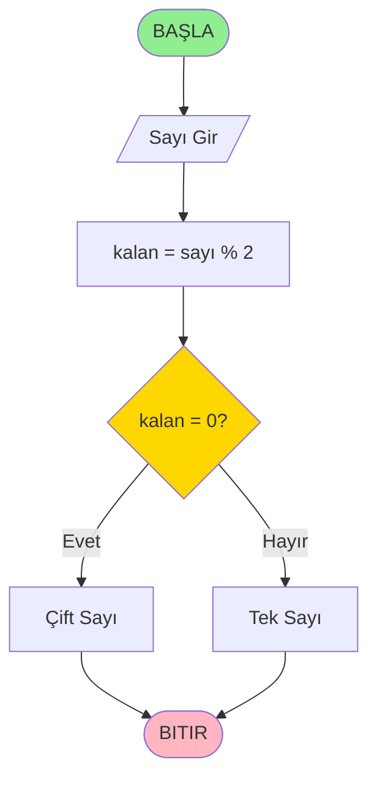

# 🎨 Draw.io Akış Diyagramı Entegrasyon Rehberi

## 📋 İçindekiler
1. [Mermaid Diyagramları](#mermaid)
2. [Draw.io Embed Kodu](#drawio-embed)
3. [PNG/SVG Resim Entegrasyonu](#resim)
4. [XML Kod Paylaşımı](#xml)
5. [İnteraktif Diyagramlar](#interaktif)

---

## 🔸 1. Mermaid Diyagramları {#mermaid}

### ✅ GitHub/VS Code Uyumlu


### 🎯 Avantajları:
- ✅ GitHub README'de direkt görünür
- ✅ VS Code extension desteği
- ✅ Otomatik render
- ✅ Versiyon kontrolü kolay

---

## 🔸 2. Draw.io Embed Kodu {#drawio-embed}

### 📊 HTML Embed
```html
<iframe frameborder="0" style="width:100%;height:400px;" 
src="https://viewer.diagrams.net/?highlight=0000ff&edit=_blank&layers=1&nav=1&title=Akis_Diyagrami#R7VhNc9owEP01PqYjy5ZsH2Mgaae0nU4605ZeOsKWQY1sOXJMIL%2B%2BKyPJH7KTQCYE0kMOXq1Wq%2FfetytBB4zj1ReJ0uiGB5h1ABqs..."></iframe>
```

### 🔗 Link Entegrasyonu
```markdown
**📊 İnteraktif Diyagram:**
[Bu akış diyagramını Draw.io'da düzenlemek için tıklayın](https://app.diagrams.net/#G1a2b3c4d5e6f7g8h9i0)

**💾 Dosya İndirme:**
[PNG İndir](./diagrams/cift_tek_kontrol.png) | 
[PDF İndir](./diagrams/cift_tek_kontrol.pdf) | 
[Draw.io Dosyası](./diagrams/cift_tek_kontrol.drawio)
```

---

## 🔸 3. PNG/SVG Resim Entegrasyonu {#resim}

### 🖼️ Markdown Resim Gösterimi
```markdown
### 📊 Akış Diyagramı

*Şekil 1: Çift/Tek sayı kontrolü algoritması*

<!-- Boyutlandırma ile -->

```

### 📁 Dosya Organizasyonu
```
Hafta02/
├── ders_icerik.md
├── images/
│   ├── toplama_flowchart.png
│   ├── cift_tek_flowchart.svg
│   └── faktoriyel_flowchart.pdf
├── diagrams/
│   ├── toplama.drawio
│   ├── cift_tek.drawio
│   └── faktoriyel.drawio
└── templates/
    └── bos_flowchart_template.drawio
```

---

## 🔸 4. XML Kod Paylaşımı {#xml}

### 📄 Draw.io XML Formatı
```xml
<!-- Bu kodu Draw.io'ya yapıştırarak diyagramı açabilirsiniz -->
<mxfile host="app.diagrams.net" modified="2024-01-15T10:30:00.000Z">
  <diagram name="Çift-Tek Kontrol" id="c7558073-3199-34d8-9f00-201c6e0b9035">
    <mxGraphModel dx="1422" dy="794" grid="1" gridSize="10" guides="1">
      <root>
        <mxCell id="0"/>
        <mxCell id="1" parent="0"/>
        
        <!-- Başla Terminal -->
        <mxCell id="start" value="BAŞLA" 
               style="ellipse;whiteSpace=wrap;html=1;fillColor=#d5e8d4;strokeColor=#82b366;" 
               vertex="1" parent="1">
          <mxGeometry x="340" y="40" width="120" height="60" as="geometry"/>
        </mxCell>
        
        <!-- Giriş -->
        <mxCell id="input" value="Sayı Gir" 
               style="shape=parallelogram;perimeter=parallelogramPerimeter;whiteSpace=wrap;html=1;fillColor=#dae8fc;strokeColor=#6c8ebf;" 
               vertex="1" parent="1">
          <mxGeometry x="340" y="140" width="120" height="60" as="geometry"/>
        </mxCell>
        
        <!-- İşlem -->
        <mxCell id="process" value="kalan = sayı % 2" 
               style="rounded=0;whiteSpace=wrap;html=1;fillColor=#fff2cc;strokeColor=#d6b656;" 
               vertex="1" parent="1">
          <mxGeometry x="340" y="240" width="120" height="60" as="geometry"/>
        </mxCell>
        
        <!-- Karar -->
        <mxCell id="decision" value="kalan = 0 ?" 
               style="rhombus;whiteSpace=wrap;html=1;fillColor=#f8cecc;strokeColor=#b85450;" 
               vertex="1" parent="1">
          <mxGeometry x="340" y="340" width="120" height="80" as="geometry"/>
        </mxCell>
        
        <!-- Bağlantılar -->
        <mxCell id="edge1" style="edgeStyle=orthogonalEdgeStyle;rounded=0;orthogonalLoop=1;jettySize=auto;html=1;" 
               edge="1" parent="1" source="start" target="input">
          <mxGeometry relative="1" as="geometry"/>
        </mxCell>
        
      </root>
    </mxGraphModel>
  </diagram>
</mxfile>
```

### 🔄 Kullanım Adımları:
1. Yukarıdaki XML kodunu kopyala
2. Draw.io'ya git (app.diagrams.net)
3. File → Import from → Text
4. XML kodunu yapıştır
5. Diyagram otomatik yüklenir

---

## 🔸 5. İnteraktif Diyagramlar {#interaktif}

### 🎮 Clickable Flowchart
```html
<div class="interactive-flowchart">
  <svg width="600" height="400">
    <!-- Tıklanabilir elementler -->
    <ellipse cx="300" cy="50" rx="60" ry="30" 
             onclick="showInfo('start')" 
             style="fill:#90EE90;cursor:pointer"/>
    <text x="300" y="55" text-anchor="middle">BAŞLA</text>
    
    <rect x="240" y="120" width="120" height="60" 
          onclick="showInfo('input')" 
          style="fill:#87CEEB;cursor:pointer"/>
    <text x="300" y="155" text-anchor="middle">Sayı Gir</text>
  </svg>
  
  <div id="info-panel">
    <!-- Bilgi paneli -->
  </div>
</div>

<script>
function showInfo(element) {
  const infoPanel = document.getElementById('info-panel');
  switch(element) {
    case 'start':
      infoPanel.innerHTML = '<h4>Başlangıç</h4><p>Algoritmanın başlangıç noktası</p>';
      break;
    case 'input':
      infoPanel.innerHTML = '<h4>Giriş</h4><p>Kullanıcıdan sayı alınır</p>';
      break;
  }
}
</script>
```

### 🔄 Animasyonlu Akış
```css
.flowchart-animation {
  animation: flow 3s infinite;
}

@keyframes flow {
  0% { stroke-dashoffset: 100; }
  100% { stroke-dashoffset: 0; }
}
```

---

## 📊 Pratik Uygulama Örneği

### 🎯 Toplama Algoritması - Multi-Format
```markdown
## Toplama Algoritması

### 📋 Sözde Kod:
\```
BAŞLA
  sayı1 ← Kullanıcıdan al
  sayı2 ← Kullanıcıdan al
  toplam ← sayı1 + sayı2
  Yazdır toplam
BITIR
\```

### 📊 Mermaid Diyagramı:
\```mermaid
flowchart TD
    A([BAŞLA]) --> B[/sayı1 al/]
    B --> C[/sayı2 al/]
    C --> D[toplam = sayı1 + sayı2]
    D --> E[/toplam yazdır/]
    E --> F([BITIR])
\```

### 🖼️ Draw.io Çıktısı:


### 🔗 İnteraktif Versiyon:
[Draw.io'da Düzenle](https://app.diagrams.net/#Htoplama_algoritması.drawio)

### 💾 Dosyalar:
- [PNG İndir](./downloads/toplama.png)
- [PDF İndir](./downloads/toplama.pdf)
- [Draw.io Kaynak](./downloads/toplama.drawio)
```

---

## 🎯 Öğretmenler İçin Faydalı İpuçları

### ✅ En İyi Pratikler:
1. **Çoklu Format:** Hem Mermaid hem Draw.io kullan
2. **Dosya Organizasyonu:** Klasör yapısını düzenli tut
3. **Backup:** XML kodlarını metin dosyası olarak sakla
4. **Versiyon Kontrolü:** Git ile diyagram versiyonlarını takip et
5. **Öğrenci Erişimi:** Hem görsel hem düzenlenebilir format sun

### 🔧 Teknik İpuçları:
- SVG format kullan (ölçeklenebilir)
- Renk kodlamasını tutarlı yap
- Font boyutlarına dikkat et
- Mobil uyumluluğu test et
- Yavaş internet için optimize et

---

## 📞 Destek ve Kaynaklar

### 🔗 Yararlı Linkler:
- [Draw.io Resmi Dokümantasyon](https://www.diagrams.net/doc/)
- [Mermaid Syntax Rehberi](https://mermaid-js.github.io/mermaid/)
- [Flowchart Sembolleri Standartları](https://en.wikipedia.org/wiki/Flowchart)

### 💡 Topluluk Desteği:
- [Draw.io GitHub](https://github.com/jgraph/drawio)
- [Stack Overflow: Flowchart](https://stackoverflow.com/questions/tagged/flowchart)
- [Reddit: r/flowcharts](https://reddit.com/r/flowcharts)