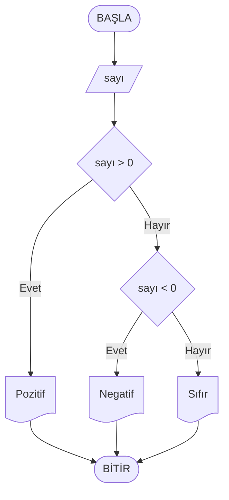
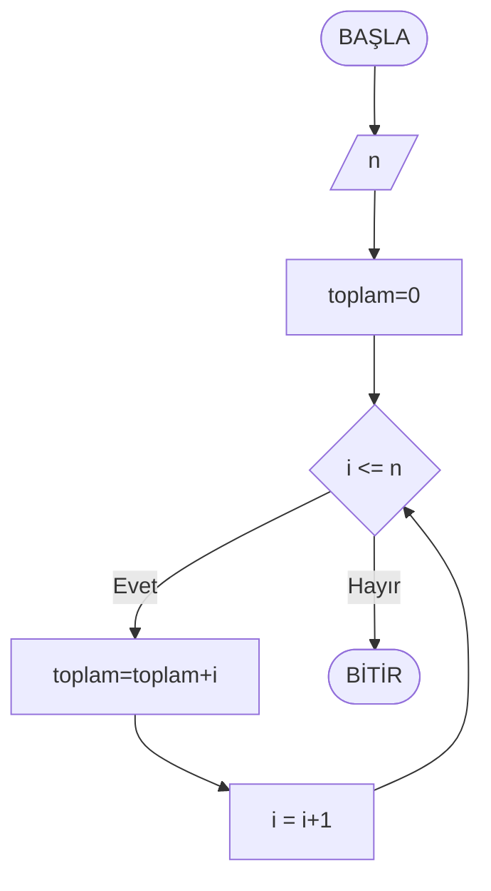
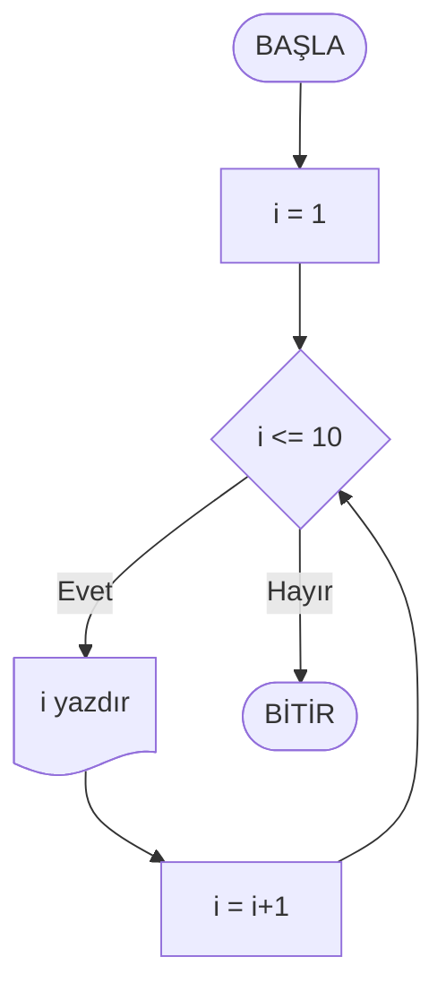
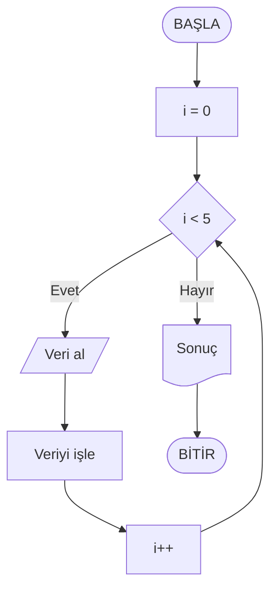
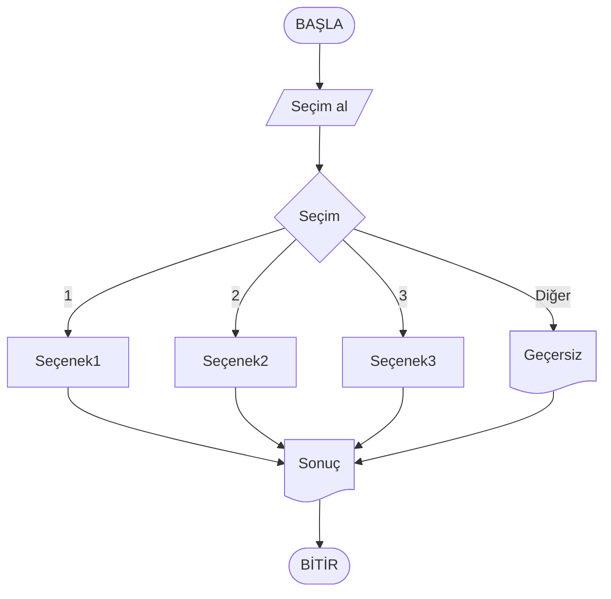
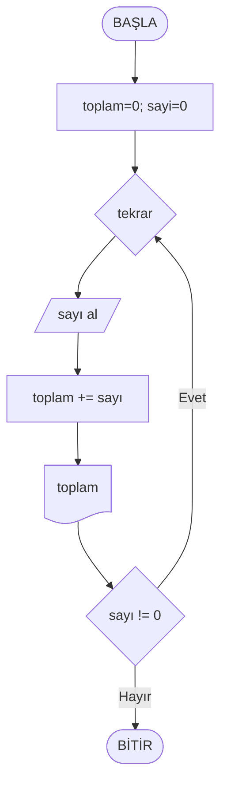

# Hafta 03: Kontrol Yapıları (Koşul ve Döngüler)

<div align="center">
<sub>
Gezin: [Hafta01](../Hafta01/ders_icerik.md) · [Hafta02](../Hafta02/ders_icerik.md) · Hafta03 · Hafta04 · Hafta05 · Hafta06 · Hafta07 · Hafta08 · Hafta09 · Hafta10 · Hafta11 · Hafta12 · Hafta13 · Hafta14
</sub>
</div>

> 🔗 Diyagram standartları için bkz: [Diyagram Kullanım Rehberi](../Diyagram_Kullanim_Rehberi.md)

## Ders Hedefleri
Bu dersin sonunda öğrenciler:
- Koşul yapılarını anlayacak ve kullanacak
- Döngü yapılarını kavrayacak
- Karmaşık algoritmalarda kontrol yapılarını uygulayacak

## 1. Kontrol Yapıları Nedir?

**Kontrol yapıları**, programın akışını yönlendiren yapılardır. Programların sadece yukarıdan aşağıya çalışmasını engeller ve:
- Belirli koşullarda farklı işlemler yapar
- Aynı işlemleri tekrarlar
- Program akışını dinamik hale getirir

### Kontrol Yapıları Türleri
1. **Sıralı Yapı:** Normal akış (yukarıdan aşağıya)
2. **Seçmeli Yapı:** Koşullara göre farklı yollar (if-else, switch)
3. **Tekrarlı Yapı:** Döngüler (for, while, do-while)

## 2. Koşul Yapıları

### 2.1 IF-ELSE Yapısı

**IF yapısı**, belirli bir koşul sağlandığında işlem yapar.

#### Temel IF
```
EĞER koşul İSE
  işlem
```

#### IF-ELSE
```
EĞER koşul İSE
  işlem1
DEĞILSE
  işlem2
```

#### IF-ELSE IF-ELSE (Çoklu Koşul)
```
EĞER koşul1 İSE
  işlem1
DEĞILSE EĞER koşul2 İSE
  işlem2
DEĞILSE EĞER koşul3 İSE
  işlem3
DEĞILSE
  işlem4
```

### 2.2 SWITCH-CASE Yapısı

Bir değişkenin birden fazla durumunu kontrol etmek için kullanılır.

```
DEĞİŞKEN seçim'E GÖRE
  DURUM 1:
    işlem1
    ÇIK
  DURUM 2:
    işlem2
    ÇIK
  DURUM 3:
    işlem3
    ÇIK
  VARSAYILAN:
    varsayılan_işlem
```

## 3. Karşılaştırma Operatörleri

- `==` : Eşit mi?
- `!=` : Eşit değil mi?
- `>`  : Büyük mü?
- `<`  : Küçük mü?
- `>=` : Büyük eşit mi?
- `<=` : Küçük eşit mi?

## 4. Mantıksal Operatörler

- `VE` veya `AND` veya `&&` : Her iki koşul da doğru
- `VEYA` veya `OR` veya `||` : En az bir koşul doğru
- `DEĞİL` veya `NOT` veya `!` : Koşulun tersi

### Örnekler:
```
// VE operatörü
EĞER yaş >= 18 VE ehliyet = "var" İSE
  Yazdır "Araba kullanabilir"

// VEYA operatörü  
EĞER gün = "cumartesi" VEYA gün = "pazar" İSE
  Yazdır "Hafta sonu"

// DEĞİL operatörü
EĞER DEĞİL (yaş < 18) İSE
  Yazdır "Reşit"
```

## 5. Döngü Yapıları

### 5.1 FOR Döngüsü

Belirli sayıda tekrar için kullanılır.

```
İÇİN değişken = başlangıç'dan bitiş'e KADAR ADIM artış
  işlem
```

**Örnek:**
```
İÇİN i = 1'den 10'a KADAR
  Yazdır i
```

### 5.2 WHILE Döngüsü

Koşul doğru olduğu sürece çalışır.

```
KOŞUL koşul İKEN
  işlem
  // Koşulu değiştiren işlem
```

**Örnek:**
```
sayaç = 1
KOŞUL sayaç <= 5 İKEN
  Yazdır sayaç
  sayaç = sayaç + 1
```

### 5.3 DO-WHILE Döngüsü

En az bir kez çalışması garanti edilen döngü.

```
YAP
  işlem
KOŞUL koşul İKEN
```

**Örnek:**
```
YAP
  sayı ← Kullanıcıdan sayı al
  Yazdır "Girdiğiniz sayı: " + sayı
KOŞUL sayı != 0 İKEN
```

## 6. Detaylı Örnekler

> ℹ️ Not: Tüm akış diyagramları artık yalnızca Mermaid ile oluşturulmuştur. Render edilmiyorsa kod bloklarını https://mermaid.live adresinde açabilirsiniz.

### Örnek 1: Sayının Pozitif/Negatif Kontrolü

**Problem:** Girilen sayının pozitif, negatif veya sıfır olduğunu belirleyen program.

**Sözde Kod:**
```
BAŞLA
  Yazdır "Bir sayı girin:"
  sayı ← Kullanıcıdan sayı al
  
  EĞER sayı > 0 İSE
    Yazdır sayı + " pozitif bir sayıdır"
  DEĞILSE EĞER sayı < 0 İSE
    Yazdır sayı + " negatif bir sayıdır"
  DEĞILSE
    Yazdır "Girdiğiniz sayı sıfırdır"
BITIR
```
### Örnek 2: 1'den 10'a Kadar Sayıları Yazdırma

**FOR Döngüsü ile:**
```
BAŞLA
  İÇİN i = 1'den 10'a KADAR
    Yazdır i
BITIR
```

**WHILE Döngüsü ile:**
```
BAŞLA
  i = 1
  KOŞUL i <= 10 İKEN
    Yazdır i
    i = i + 1
BITIR
```

### Örnek 3: Sayı Tahmin Oyunu

**Problem:** 1-100 arası rastgele sayıyı tahmin etme oyunu.

**Sözde Kod:**
```
BAŞLA
  doğruSayı ← RastgeleSayı(1, 100)
  tahminHakkı ← 5
  
  Yazdır "1-100 arası bir sayı tuttum. " + tahminHakkı + " hakkınız var!"
  
  KOŞUL tahminHakkı > 0 İKEN
    Yazdır "Tahmininiz: "
    tahmin ← Kullanıcıdan sayı al
    
    EĞER tahmin = doğruSayı İSE
      Yazdır "Tebrikler! Doğru tahmin!"
      ÇIK döngüden
    DEĞILSE EĞER tahmin < doğruSayı İSE
      Yazdır "Daha büyük bir sayı deneyin"
    DEĞILSE
      Yazdır "Daha küçük bir sayı deneyin"
    
    tahminHakkı ← tahminHakkı - 1
  
  EĞER tahminHakkı = 0 İSE
    Yazdır "Oyun bitti! Doğru sayı: " + doğruSayı
BITIR
```

### Örnek 4: Öğrenci Notu Değerlendirme (Switch-Case)

**Problem:** Harf notuna göre açıklama yazdıran program.

**Sözde Kod:**
```
BAŞLA
  Yazdır "Harf notunuzu girin (A, B, C, D, F):"
  harfNotu ← Kullanıcıdan harf al
  
  DEĞİŞKEN harfNotu'NA GÖRE
    DURUM 'A':
      Yazdır "Mükemmel! (90-100)"
      ÇIK
    DURUM 'B':
      Yazdır "İyi! (80-89)"
      ÇIK
    DURUM 'C':
      Yazdır "Orta! (70-79)"
      ÇIK
    DURUM 'D':
      Yazdır "Geçer! (60-69)"
      ÇIK
    DURUM 'F':
      Yazdır "Kaldı! (0-59)"
      ÇIK
    VARSAYILAN:
      Yazdır "Geçersiz not! Lütfen A, B, C, D veya F girin."
BITIR
```

### Örnek 5: Kullanıcıdan Veri Alma (Do-While)

**Problem:** Kullanıcıdan sürekli sayı alıp toplamını hesaplayan, 0 girilince durduran program.

**Sözde Kod:**
```
BAŞLA
  toplam = 0
  sayıAdedi = 0
  
  Yazdır "Sayı girin (0 = çıkış):"
  
  YAP
    sayı ← Kullanıcıdan sayı al
    
    EĞER sayı != 0 İSE
      toplam = toplam + sayı
      sayıAdedi = sayıAdedi + 1
      Yazdır "Şu anki toplam: " + toplam
      Yazdır "Başka sayı girin (0 = çıkış):"
  KOŞUL sayı != 0 İKEN
  
  EĞER sayıAdedi > 0 İSE
    ortalama = toplam / sayıAdedi
    Yazdır "Girilen " + sayıAdedi + " sayının toplamı: " + toplam
    Yazdır "Ortalama: " + ortalama
  DEĞILSE
    Yazdır "Hiç sayı girilmedi."
BITIR
```

## 7. İç İçe Yapılar

### İç İçe IF Yapıları
```
EĞER yaş >= 18 İSE
  EĞER ehliyet = "var" İSE
    EĞER arabaVarMı = "evet" İSE
      Yazdır "Araba kullanabilir"
    DEĞILSE
      Yazdır "Araba kiralayabilir"
  DEĞILSE
    Yazdır "Önce ehliyet almalı"
DEĞILSE
  Yazdır "18 yaşını beklemeli"
```

### İç İçe Döngüler
```
// Çarpım tablosu
İÇİN i = 1'den 10'a KADAR
  İÇİN j = 1'den 10'a KADAR
    çarpım = i * j
    Yazdır i + " x " + j + " = " + çarpım
  Yazdır "---" // Satır sonu
```

### Kontrol Yapıları Örnekleri (Mermaid)

#### 📝 Örnek 1: IF-ELSE Diyagramı
**Problem:** Sayının pozitif, negatif veya sıfır olduğunu belirleyen algoritma

**Sözde Kod:**
```
BAŞLA
    "Bir sayı girin: " yazdır
    sayı'yı oku
    EĞER sayı > 0 İSE
        "Sayı pozitifdir" yazdır
    DEĞİLSE EĞER sayı < 0 İSE
        "Sayı negatiftir" yazdır
    DEĞİLSE
        "Sayı sıfırdır" yazdır
    SON
BITIR
```

**Mermaid Akış Diyagramı (GitHub uyumlu klasik sözdizimi):**

#### 📝 Örnek 1.1: FOR Döngüsü Diyagramı
**Problem:** 1'den n'e kadar sayıların toplamını yazdıran algoritma

**Sözde Kod:**
```
BAŞLA
    n <- kullanıcıdan tam sayı al
    toplam=0
    İÇİN i = 1'den n'e KADAR
        toplam=toplam+i
    DÖNGÜ SON
    Yazdır toplam
BITIR
```

**Mermaid Akış Diyagramı (GitHub uyumlu):**


#### 📝 Örnek 2: FOR Döngüsü Diyagramı
**Problem:** 1'den 10'a kadar sayıları yazdıran algoritma

**Sözde Kod:**
```
BAŞLA
    İÇİN i = 1'den 10'a KADAR
        i değerini yazdır
    DÖNGÜ SON
BITIR
```

**Mermaid Akış Diyagramı (GitHub uyumlu):**


#### 📝 Örnek 3: WHILE Döngüsü Diyagramı
**Problem:** Kullanıcıdan 5 kez veri alıp işleyen algoritma

**Sözde Kod:**
```
BAŞLA
    i = 0
    KOŞUL i < 5 İKEN
        kullanıcıdan veri al
        veriyi işle
        i = i + 1
    DÖNGÜ SON
    Sonuç göster
BITIR
```

**Mermaid Akış Diyagramı (GitHub uyumlu):**


#### 📝 Örnek 4: SWITCH-CASE Diyagramı
**Problem:** Menü seçimlerine göre farklı işlemler yapan algoritma

**Sözde Kod:**
```
BAŞLA
    secim değerini kullanıcıdan al
    DURUM secim
        1 ise: Seçenek 1 işlemi
        2 ise: Seçenek 2 işlemi
        3 ise: Seçenek 3 işlemi
        diğer: Geçersiz seçim mesajı
    SON
    Sonuç göster
BITIR
```

**Mermaid Akış Diyagramı (GitHub uyumlu):**


#### 📝 Örnek 5: DO-WHILE Döngüsü Diyagramı
**Problem:** En az bir kez çalışması gereken sayı toplama programı

**Sözde Kod:**
```
BAŞLA
    toplam = 0
    sayi = 0
    KÖR
        sayi değerini kullanıcıdan al
        toplam = toplam + sayi
        toplam değerini göster
    sayi != 0 İKEN
BITIR
```

**Mermaid Akış Diyagramı (GitHub uyumlu):**


#### Bilgi
Örnek diyagramlarda ek bir çizim aracına gerek kalmadan tüm mantık Mermaid ile ifade edilmiştir.

## 9. Yaygın Hatalar ve Çözümleri

### Sonsuz Döngü
**Hata:**
```
i ← 1
KOŞUL i <= 10 İKEN
  Yazdır i
  // i artırılmayı unutulmuş!
```

**Doğrusu:**
```
i = 1
KOŞUL i <= 10 İKEN
  Yazdır i
  i = i + 1  // Çok önemli!
```

### Mantık Hatası
**Hata:**
```
EĞER yaş >= 18 VEYA yaş < 65 İSE  // Yanlış mantık
  Yazdır "Çalışabilir"
```

**Doğrusu:**
```
EĞER yaş >= 18 VE yaş < 65 İSE  // Doğru mantık
  Yazdır "Çalışabilir"
```

## 10. Performans Tüyoları

1. **Switch vs If-Else:** Çok fazla durum varsa switch kullanın
2. **Döngü Optimizasyonu:** Gereksiz hesaplamaları döngü dışına çıkarın
3. **Koşul Sıralaması:** Daha sık gerçekleşen koşulları önce yazın

## Değerlendirme Kriterleri

### Lab Çalışması (%100)
- Koşul yapısı doğru kullanımı (30%)
- Döngü yapısı doğru kullanımı (30%)
- Problem çözme yaklaşımı (25%)
- Kod temizliği ve okunabilirlik (15%)

## Sonraki Hafta Hazırlığı
- C# programlama dili temelleri
- Visual Studio kurulumu
- İlk C# programı yazma

## Ödev

### Teorik Ödev
1. **Kontrol Yapıları Karşılaştırması** (200 kelime):
   - IF-ELSE ile SWITCH-CASE arasındaki farklar
   - Hangi durumlarda hangisini kullanmak daha uygun?

2. **Döngü Türleri Analizi** (150 kelime):
   - FOR, WHILE ve DO-WHILE döngülerinin kullanım alanları

### Pratik Ödev

#### Zorunlu Görevler:

1. **Hesap Makinesi**
   - Dört işlem yapabilen
   - Sürekli çalışan (kullanıcı çıkış yapana kadar)
   - Sıfıra bölme kontrolü olan
   - Sözde kod + akış diyagramı

2. **Asal Sayı Kontrolü**
   - Girilen sayının asal olup olmadığını bulan
   - 1'den girilen sayıya kadar kontrol eden
   - Sözde kod + akış diyagramı

3. **Menü Sistemi**
   - Switch-case kullanarak
   - En az 5 seçenek
   - Geçersiz seçim kontrolü
   - Sözde kod

#### Bonus Görevler:

4. **Fibonacci Serisi**
   - İlk N Fibonacci sayısını yazdıran
   - N kullanıcıdan alınan
   - Hem FOR hem WHILE ile çözüm

5. **Sayı Piramidi**
   - İç içe döngü kullanarak
   - Kullanıcının istediği satır sayısında
   - Örnek (5 satır):
   ```
   1
   12
   123
   1234
   12345
   ```

### Teslim Formatı
- Her ödev için ayrı dosya
- Sözde kod + akış diyagramı (gerekirse)
- Algoritmanın çalışma mantığını açıklayan kısa paragraf
- Test senaryoları (girdi-çıktı örnekleri)
